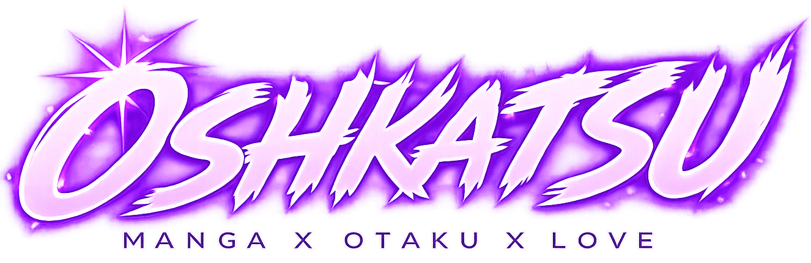
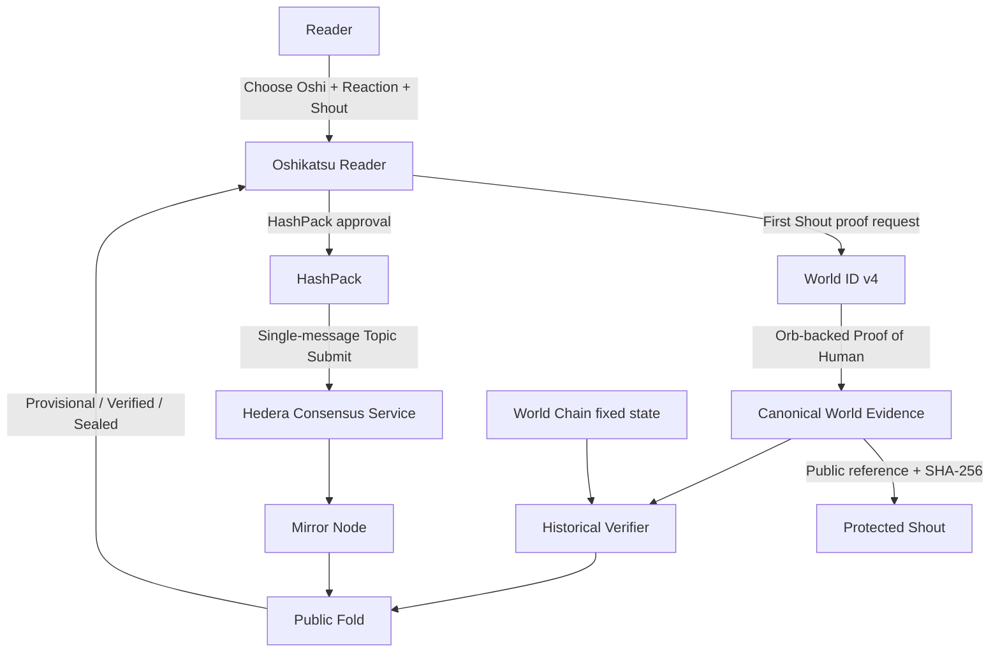
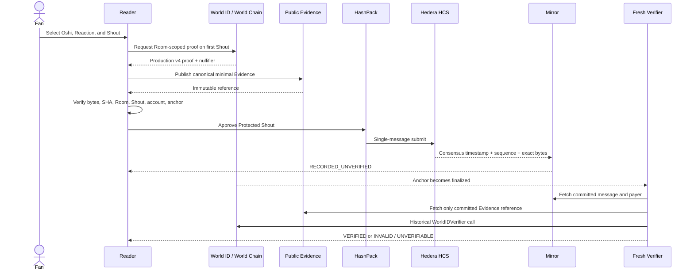
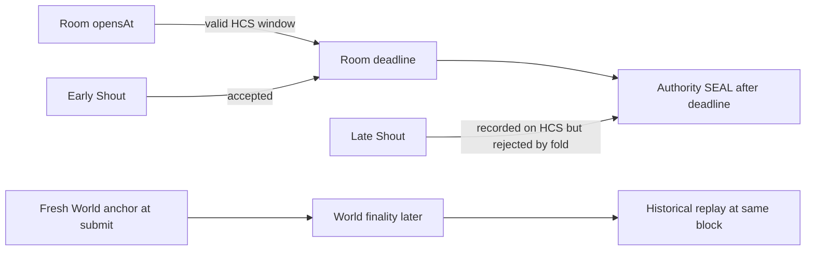
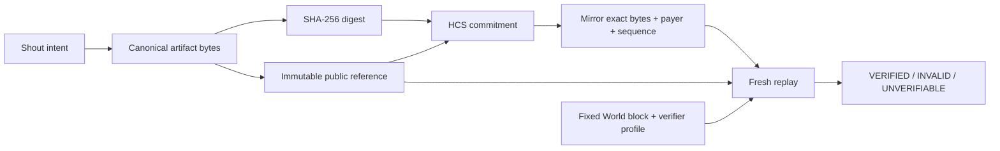

<p align="center">
	
</p>

# Oshikatsu — Evidence-Backed Fandom

> *Read together. Shout together. Verify forever.*

## One-liner

**Oshikatsu is a live manga fandom experience where a Shout is also a Vote: World ID protects one-human participation, Hedera records the exact public intent, and replayable Evidence lets anyone verify the result later.**

[Open the Reader](https://oshikatsu-reader-lisbon26.web.app) · [Integration Console](https://ethglobal-lisbon2026-oshikatsu.web.app) · [Hackathon Board](https://github.com/users/rtree/projects/1)

Product design: [日本語 SDD](software-design/sdd.md) · [English SDD](software-design/sdd.en.md)

---

# 💡 Idea

The most honest manga reaction is not a sterile checkbox. It is the thing a fan actually wants to say after finishing a chapter:

> **"That was incredible. This is my Oshi."**

Oshikatsu turns that moment into a verifiable public action.

- Choose the manga, chapter, person, or team you support.
- Add a Reaction and a short **Shout**.
- That Shout becomes your current **Vote** in the Room.
- The latest valid Shout before the deadline is your current intent.
- Everyone can feel the live Groove immediately.
- Anyone can replay the Evidence later instead of trusting the organizer.

This is the product insight:

> **Expression and voting should be the same gesture. Evidence should make that gesture trustworthy without making it feel bureaucratic.**

Oshikatsu therefore has no separate public "Ballot" experience. The user Shouts. The protocol protects the Shout.

---

# ⚙️ How it works

## 1. Enter a fixed Room

Every Room has an immutable manifest containing its candidates, Hedera topic, opening time, and deadline. A normal Room celebrates manga; a Special Room can celebrate people or teams.

The organizer cannot silently move the deadline or swap candidates after voting starts.

👉 **The rules are fixed before the crowd arrives.**

---

## 🌋 2. Shout for your Oshi

The Reader chooses one candidate, a Reaction, and a short message. `Send Shout` is the Vote action.

A Reaction by itself is atmosphere. A Shout carries current intent.

```text
work/person + reaction + short message + Room + Hedera account
													 ↓
										 Protected Shout
```

The same wallet can Shout again; HCS consensus order determines which valid Shout is current. Firestore arrival order and API timing never decide the winner.

👉 **The emotional action is the voting action.**

---

## 🌍 3. Prove one human on the first Shout

For a protected Room, the first Shout requests an Orb-backed World ID v4 Proof of Human.

World ID is not used to publish a real-world identity. It supplies a Room-scoped nullifier so the protocol can distinguish:

- the same human trying again in the same Room;
- another human in that Room; and
- the same human participating in a different Room.

The Room, selected nominee, Shout intent, expected Hedera account, and World anchor are bound together.

👉 **World proves eligibility, not personality.**

---

## 🧾 4. Preserve canonical Evidence

The raw World result is larger than the safe HCS application budget, so Oshikatsu separates **integrity** from **transport**:

1. Encode only the verification-required fields into a versioned canonical artifact.
2. Compute SHA-256 over the exact artifact bytes.
3. Publish those bytes at a commit-fixed or content-addressed public reference.
4. Commit the digest, reference, Room binding, expected payer, and World anchor into the Protected Shout evidence envelope.
5. Re-fetch and verify the bytes before asking HashPack to sign.

The current repository retains the internal name `Ballot v2` for this evidence envelope. It is an implementation identifier, **not a second user action**.

👉 **The backend may publish Evidence, but it cannot define whether that Evidence is valid.**

---

## ⛓️ 5. HashPack records the Shout on Hedera

The connected HashPack account signs and pays for a native Hedera Consensus Service message.

Protocol constraints are deliberate:

- one HCS message only;
- maximum 900 UTF-8 bytes;
- `setMaxChunks(1)`;
- reject oversize input before opening the wallet;
- do not call wallet success a confirmed Vote;
- require Mirror to return the same payer and exact bytes.

HCS becomes the public clock and ordering authority.

👉 **Hedera proves who posted what, and when consensus accepted it.**

---

## 🔍 6. Verify now, or replay later

Mirror confirmation first produces an optimistic receipt:

```text
RECORDED_UNVERIFIED
				↓
WAITING_WORLD_FINALITY
				↓
VERIFIED / INVALID / UNVERIFIABLE
				↓
CAPABILITY_GRANTED / NULLIFIER_CONFLICT
```

The Reader may show a provisional ranking immediately, but it must not pretend that recorded means verified.

Later, a fresh verifier can:

1. fetch the exact HCS message and payer from Mirror;
2. follow only the public Evidence reference committed in that message;
3. recompute the SHA-256 and all Room/Shout/account bindings;
4. check the pinned World block hash and finality;
5. replay the official WorldIDVerifier at that historical state; and
6. fold current Shouts in HCS sequence order.

👉 **Fast feedback and delayed certainty coexist without inventing certainty.**

---

## 🏆 7. Rank, close, and replay the Room

During the Room, the UI distinguishes:

- **Provisional ranking** — recorded, currently unverifiable, and verified Shouts;
- **Verified preview** — only historically verified Shouts; and
- **Sealed result** — a manifest-bound policy, fixed cutoff, and authority-authenticated result hash.

The deadline rule is based on Hedera consensus time:

$$
	ext{opensAt} \leq \text{HCS consensus timestamp} \leq \text{deadline}
$$

A late SEAL never makes a late Shout valid.

👉 **The public event history, not the organizer's database, determines the result.**

---

# 🎯 Key Innovations

### 🌋 Shout = Vote

Oshikatsu does not bolt a polling form onto a fandom experience. The short emotional message already expresses support, so that is the intent the protocol protects.

---

### ⚡ Optimistic feeling, verified outcome

Fans see the Room react immediately. Verification can complete after World finality without granting an optimistic capability or falsely labeling an unverified Shout as final.

---

### 🔀 Two chains, separate responsibilities

World Chain verifies the human proof. Hedera establishes payer, exact bytes, ordering, and deadline position. Neither chain is asked to impersonate the other.

---

### 🧾 Evidence, not "trust our API"

The HCS event commits the exact public artifact reference and digest. A verifier ignores replacement URLs or a backend's `VALID` claim and starts from the public commitment.

---

### 🕶️ Room-scoped pseudonymity

The World nullifier is scoped to the Room action. It supports one-human participation without creating a permanent global Oshikatsu identity.

---

### 📏 Small, canonical wire messages

The 900-byte application ceiling prevents accidental HCS chunk groups and forces proof material, media, and display metadata out of the consensus hot path.

---

# ❓ Q&A — Judge Defense

## ❓ "Is a Shout just a comment?"

> **No. A Shout binds a selected nominee, Room, Hedera payer, Reaction, short message, and current intent. It is both fandom expression and Vote. A Reaction alone is not a Vote.**

---

## ❓ "Why use both World ID and Hedera?"

> **They prove different facts. World ID proves the Room-scoped human credential and nullifier. Hedera proves the signed public message, payer, consensus order, and whether it arrived before the deadline.**

---

## ❓ "Does Oshikatsu know who I am?"

> **No real-world identity is required in the protocol. The public verifier sees proof inputs, a Room-scoped nullifier commitment, and a pseudonymous Hedera account. World credential issuance remains an explicit trust boundary.**

---

## ❓ "Can the organizer rewrite the ranking?"

> **Not without contradicting public Evidence. A fresh process can rebuild accepted Shouts, current intent, and result hashes from Mirror, the committed artifact, and the pinned World state. Firestore is a rebuildable projection, not the formal source.**

---

## ❓ "Why not put the entire World proof in HCS?"

> **The proof is larger than the safe single-message budget. HCS stores an explicit SHA-256, immutable reference, and anchor. The full canonical artifact stays publicly retrievable and byte-verifiable.**

---

## ❓ "What if Evidence storage is down?"

> **The result is `UNVERIFIABLE`, not automatically `INVALID`. Integrity and availability are different properties. Production requires a verification horizon and independent durable replicas.**

---

## ❓ "What happened to Ballot?"

> **There is no separate Ballot action in the product. `Ballot v2` is a legacy internal wire name for the Evidence envelope generated to protect the same Shout Vote.**

---

## ❓ "Is this already production-ready?"

> **No. The Hackathon demonstrates the live Reader, World production proof, Hedera testnet records, public artifact binding, and historical replay. Independent archive providers, durable artifact replicas, multi-human scale tests, dependency remediation, and complete live lifecycle acceptance remain production gates.**

---

# 🔥 Closing Line

> **Oshikatsu turns the thing fans already want to say into a Vote nobody has to take on trust.**

---

# Architecture

## High-Level System



---

## Critical-Path Sequence



---

## Timing and Authority



| Question | Authority | Why |
|---|---|---|
| Is this a valid human proof? | Official WorldIDVerifier at the pinned World block | Replays the same credential judgment later |
| Is this unique in the Room? | Room-scoped World nullifier folded in HCS order | Prevents API arrival order from deciding conflicts |
| Who submitted the Shout? | Mirror payer from Hedera consensus | Must equal the account bound into Evidence |
| Which Shout is current? | Highest eligible HCS sequence for that capability | Update order is publicly reproducible |
| Was it before the deadline? | HCS consensus timestamp vs. manifest | The organizer cannot move the window later |
| What is the result? | Versioned fold + fixed cutoff + SEAL result hash | A fresh process can reproduce it |

---

## Evidence Chain



The critical resource is **Evidence availability**. A digest proves integrity but not availability, so Oshikatsu treats missing bytes as `UNVERIFIABLE` and keeps independent replication as a production requirement.

---

## Terms That Look Similar

| Term | Product meaning | Protocol meaning |
|---|---|---|
| **Reaction** | Emoji-scale emotion | Groove signal only; not a Vote by itself |
| **Shout** | Short fandom expression and the Vote | Current intent for the selected nominee |
| **Protected Shout** | A Shout protected by human proof and public Evidence | Canonical HCS commitment plus replay inputs |
| **`Ballot v2`** | Never shown as a second action | Legacy/internal name for the Protected Shout Evidence envelope |
| **Groove** | The Room's visible live energy | Reactions, Shouts, and participation signals |
| **Capability** | Permission to update or withdraw the current Shout | First valid Room/nullifier claim in HCS order |
| **Evidence** | Why a Vote can be trusted later | Canonical World artifact + HCS message + Mirror metadata + fixed World state |

---

## Trust Boundary

| Component | Trusted for | Not trusted for |
|---|---|---|
| World / Orb credential issuance | Issuing the Proof of Human credential | Hedera ordering or Room deadline |
| WorldIDVerifier state | Formal proof validation at a pinned block | Deciding which HCS event came first |
| HashPack | User approval and Hedera account signature/payment | Human uniqueness |
| Hedera HCS | Public order, payer, exact message, consensus time | World proof validation |
| Mirror Node | Public retrieval of HCS evidence | Defining protocol rules |
| Public artifact publisher | Making committed bytes available | Declaring those bytes valid |
| Oshikatsu API / Firestore | Fast projections and orchestration | Formal validity or irreversible authority |

---

## Tech Stack

| Layer | Technology | Role |
|---|---|---|
| Reader | React 19, TypeScript, Vite | Live Room, Shout, rankings, Special Room |
| Wallet | HashPack via Hedera WalletConnect / Reown | User-approved native HCS submission |
| Human proof | World ID v4 `proof_of_human` | Room-scoped human eligibility |
| Proof replay | World Chain, official WorldIDVerifier | Historical verification at a fixed anchor |
| Public log | Hedera Consensus Service | Exact bytes, payer, sequence, deadline authority |
| Read path | Hedera Mirror Node | Public transaction and topic evidence |
| Canonical protocol | `@oshikatsu/protocol` | Strict schemas, hashes, 900-byte boundaries, golden vectors |
| API | Express on Cloud Run | Requests, projections, verification observations |
| Projection | Firestore | Durable but rebuildable read models |
| Hosting | Firebase Hosting | Reader and integration console |

---

## Real-Network Evidence Snapshot

| Evidence | Observed value | Meaning |
|---|---|---|
| World protocol | Production `4.0` `proof_of_human` | Real Orb-backed credential path, not a mock proof |
| World Chain | Chain ID `480` | Historical verifier state lives on World Chain |
| WorldIDVerifier proxy | `0x00000000009E00F9FE82CfeeBB4556686da094d7` | Official verification target used by the replay harness |
| World anchor | Block `32845156` · `0xde1d4de7...02f210` | Fixed state used for the production-proof replay |
| Historical replay | Valid proof returned; one-bit-altered input reverted | H1 passed with one public archive provider |
| Public artifact | SHA-256 [`2de1876d...9444e6`](https://raw.githubusercontent.com/rtree/oshikatsu/0c8018d691ec00952ae24a9a3015aae0c58738b4/a/2de1876db9e5ba59cbe8b6b5b111eb0b55b42e3283c5f64749e1db8cdd9444e6.json) | Anonymous read-back, strict canonical decode, and binding checks passed |
| Hedera network | Testnet topic `0.0.9745676` | Public ordered message stream |
| HashPack payer | `0.0.9706029` | Mirror payer matched the expected Hedera account |
| Protected Shout evidence | Sequence `11` · `615` bytes · event `d134899f...db9c53` | Internal `Ballot v2` envelope moved from recorded to historically `VERIFIED` |

These values are Hackathon evidence, not a permanent production profile. A production release still pins full dependency commits, ABI/code hashes, multiple archive observations, artifact replicas, and a documented verification horizon.

---

## What Is Real vs. What Remains

| Capability | Status | Evidence / next boundary |
|---|---|---|
| Reader, normal Rooms, Special Room, one-wallet current-Shout ranking | **Deployed** | Public Reader and real HashPack/Mirror Shouts |
| First-Shout World ID gate in demo Rooms | **Implemented** | Production `proof_of_human` verification gates first Shout preparation |
| HashPack single-message HCS + Mirror exact bytes/payer | **Demonstrated** | Real Hedera testnet sequences |
| Canonical public World Evidence + SHA-256 | **Demonstrated** | Commit-fixed artifact fetched anonymously and strictly decoded |
| Historical World proof replay | **Demonstrated with constraint** | Valid call and altered-input revert at fixed finalized anchor; one archive provider |
| Protected Shout evidence envelope | **Demonstrated internally** | 615-byte internal `Ballot v2` wire event, HCS sequence 11, later `VERIFIED` |
| One unified Shout submission that emits every Evidence leg | **Integration in progress** | Product decision is fixed; internal demo/evidence paths are being consolidated |
| Capability and nullifier conflict fold | **Kernel and fixture pass** | Public sequence 11 reconstructs in tests; deployed projection reconciliation remains |
| Update, withdraw, deadline, SEAL, result replay | **Kernel pass** | Canonical codecs and deterministic replay tests pass; real HCS lifecycle evidence remains |
| Artifact replicas and verification horizon | **Production gate** | Integrity works; durable independent availability remains |
| Multi-human scale and dependency hardening | **Production gate** | Required before open production launch |

---

## Repository Map

```text
software-design/
	sdd.md                 Japanese product/protocol source of truth
	sdd.en.md              English translation

poc/reader/              Public user-facing Reader
poc/console/apps/web/    Integration and evidence console
poc/console/apps/api/    Cloud Run API and projection
poc/console/packages/
	protocol/              Canonical wire formats and hashes
poc/console/scripts/     Real-network capture and replay tools
```

---

## Run Locally

Requirements: Node.js 24+, npm 11+, and the environment described in each app README.

```bash
cd poc/reader
npm install
npm run check
npm run build
npm run dev
```

The Reader runs at `http://localhost:5180` and proxies `/api` to the Cloud Run-compatible API on port `8080`.

For integration and protocol validation:

```bash
cd poc/console
npm install
npm run check
npm test
npm run check:hcs-envelope
npm run security:check
```

Never place Hedera keys, World RP signing keys, service-account JSON, or other secrets in a `VITE_` variable.

---

## Hackathon Status

- [Issue #18 — Technical / SDD quality gate](https://github.com/rtree/oshikatsu/issues/18)
- [Issue #19 — User-facing demo gate](https://github.com/rtree/oshikatsu/issues/19)
- [Oshikatsu Hackathon Board](https://github.com/users/rtree/projects/1)

The user-facing demo gate is complete. The technical gate continues to consolidate the protected Shout path and collect the remaining acceptance evidence. Closing one gate never implies the other.

---

## Investigation Note

This README was compiled from the current SDDs, Reader, API, canonical protocol package, HashPack/HCS adapters, Mirror correlation code, World artifact capture, historical verification scripts, capability/replay folds, real-network Issue evidence, and the public deployed projections.

The README intentionally distinguishes:

- what a fan experiences;
- what public Evidence proves;
- what has been demonstrated on real networks;
- what currently exists as a deterministic kernel; and
- what must still pass before production launch.

